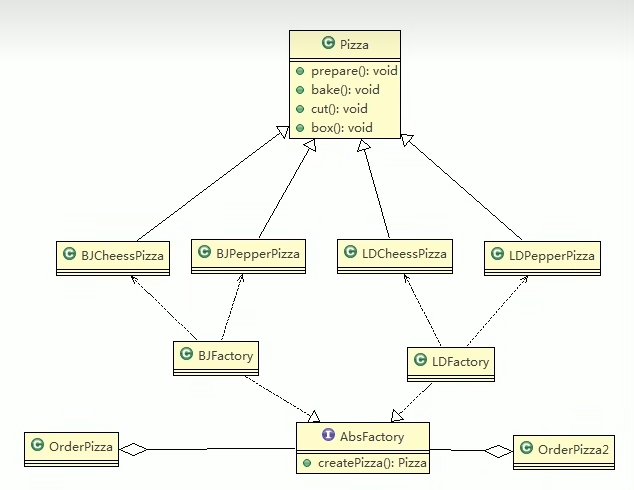

# 抽象工厂
    抽象工厂模式:定义了一个interface用于创建相关或有依赖关系的对象簇，而无需指明具体的类
    抽象工厂模式可以将简单工厂模式和工厂方法模式进行整合。
    从设计层面看，抽象工厂模式就是对简单工厂模式的改进(或者称为进一步的抽象)。
    将工厂抽象成两层，AbsFactory(抽象工厂)和具体实现的工厂子类。程序员可以根据创建对象类型使用对应的工厂子类.这样将单个的简单工厂类变成了工厂簇，更利于代码的维护和扩展.

