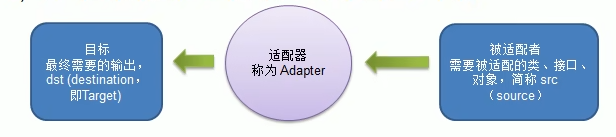
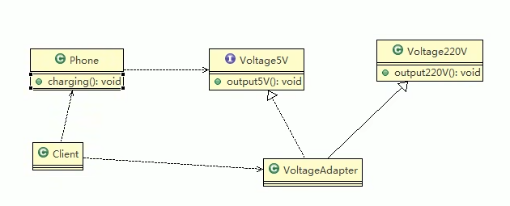
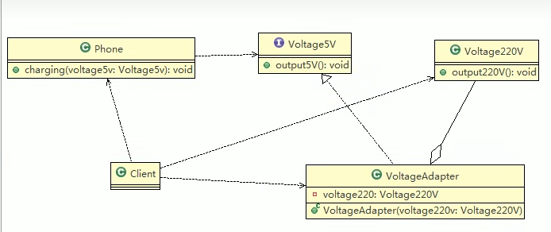

# 适配器模式
## 基本介绍
1. 适配器模式(Adapter Pattern)将某个类的接口转换成客户端期望的另一个接口表示，主的目的是兼容性，让原本因接口不匹配不能一起工作的两个类可以协同工作.其别名为包装器(Wrapper)
2. 适配器模式属于结构型模式
3. 主要分为三类:类适配器模式、对象适配器模式、接口适配器模式

## 工作原理
1. 适配器模式:将一个类的接口转换成另一种接口.让原本接口不兼容的类可以兼 容
2. 从用户的角度看不到被适配者，是解耦的
3. 用户调用适配器转化出来的目标接口方法，适配器再调用被适配者的相关接口方法
4. 用户收到反馈结果，感觉只是和目标接口交互，如图

## 类适配器模式注意事项和细节
1. Java是单继承机制，所以类适配器需要继承src类这一点算是一个缺点，因为这要求dst必须是接口，有一定局限性;
2. src类的方法在Adapter中都会暴露出来，也增加了使用的成本。
3. 由于其继承了src类，所以它可以根据需求重写src类的方法，使得Adapter的灵活性增强了.

## 对象适配器模式介绍
1. 基本思路和类的适配器模式相同，只是将Adapter类作修改，不是继承src类，而是持有src类的实例，以解决兼容性的问题。即:持有src类，实现dst类接口，完成src->dst的适配
2. 根据“合成复用原则”，在系统中尽量使用关联关系来替代继承关系。
3. 对象适配器模式是适配器模式常用的一种

## 接口适配器模式介绍
1. 一些书籍称为:适配器模式(Default Adapter Pattern)或缺省适配器模式。
2. 当不需要全部实现接口提供的方法时，可先设计一个抽象类实现接口，并为该接口中每个方法提供一个默认实现（空方法)，那么该抽象类的子类可有选择地覆盖父类的某些方法来实现需求
3. 适用于一个接口不想使用其所有的方法的情况。

## 适配器模式的注意事项和细节
1. 三种命名方式，是根据 src是以怎样的形式给到Adapter(在Adapter里的形式）来命名的。
2. 类适配器:以类给到，在Adapter里，就是将src当做类，继承 
   对象适配器:以对象给到，在Adapter里，将src作为一个对象，持有
   接口适配器:以接口给到，在Adapter里，将src作为一个接口，实现
3. Adapter模式最大的作用还是将原本不兼容的接口融合在一起工作。
4. 实际开发中，实现起来不拘泥于我们讲解的三种经典形式

