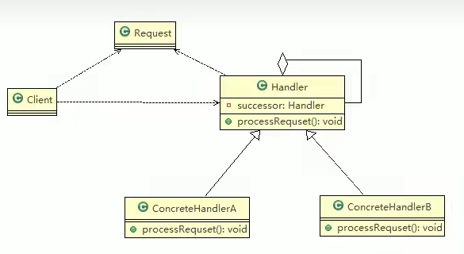
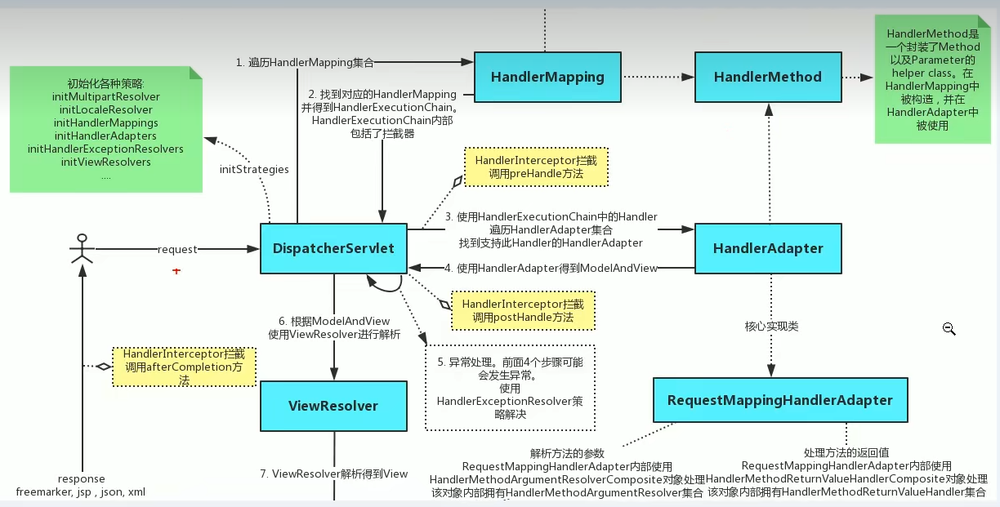

# 责任链模式
### 1. 责任链模式基本介绍
> 1. 责任链模式（Chain of Responsibility）：又叫职责链模式，为请求创建了一个**接收者对象的链**。这种模式对请求的发送者和接收者进行解耦
> 2. 责任链模式通常每个接收者都包含对另一个对象的引用。如果一个对象不能处理该请求，那么它会把相同地请求传给下一个接收者，以此类推
> 3. 这种类型的设计模式属于行为型设计模式
### 2. 责任链模式原理
> ##### 2.1 责任链模式原理类图
> 
> ##### 2.2 责任链模式原理类图说明 
> 责任链模式，使多个对象都有机会处理请求，从而避免请求的发送者和接收者之间的耦合关系。将这个对象连接成一条链，并沿着这条链传递该请求，直到有一个对象处理它为止
> - Handle：抽象的处理者，定义了一个处理请求的接口，同时还有另外的Handle
> - ConcreteHandleA,B是具体的处理者，处理他自己负责的请求，可以访问他的后继者（即下一个处理者），如果当期请求它可以处理则处理，否则交由后继者处理
> - Request：含有很多属性，表示一个请求
### 3. SpringMVC中责任链模式的应用
> ##### 3.1 SpringMVC 请求执行流程图
> 
### 4. 责任链模式的注意事项和细节
> 1. 将请求和处理分开，实现解耦，提高系统的灵活性
> 2. 简化了对象，是对象不需要知道链的结构
> 3. 性能会收到影响，特别是在链比较长的时候，因此需控制链中的最大节点数量，一般通过在Handle中设置一个最大节点数量，在setNext()方法中判断是否已经超过阈值，
> 超过则不允许该链建立，避免出现超长链无意识地破坏系统
> 4. 调试不方便。采用了类似递归的方式，调用时逻辑可能比较复杂
> 5. 最佳应用场景：由多个对象可以处理同一个请求时，比如：多级请求、请假/加薪等审批流程、Java Web中Tomcat对Encoding的处理和拦截器等