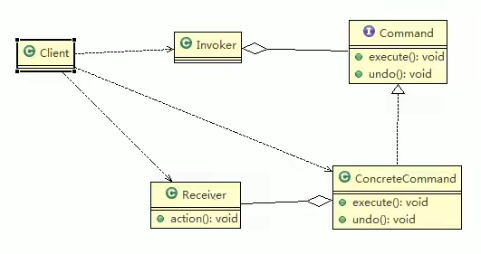

# 命名模式
### 1. 命令模式基本介绍
>1. 命令模式（Command Pattern）：在软件设计中，我么经常需要向某些对象发送请求，但是并不知道请求的接收者是谁，也不知道被请求的操作是哪个，
我们只需要在程序运行时指定具体的请求接收者即可，此时，可以使用命令模式来进行设计
>2. 命令模式使得请求发送者与请求接收者消除彼此之间的耦合，让对象之间的调用关系更加；灵活，实现解耦
>3. 在命名模式中，会将一个请求封装为一个对象，以便使用不同参数来表示不同的请求（即命名），同时命令模式也支持可撤销的操作
>4. 通俗易懂的理解：将军发布命令，士兵去执行。其中有几个角色：将军（命令发布者）、士兵（命令的具体执行者）、命令（连接将军和士兵）。
Invoker是调用者（将军），Receiver是被调用者（士兵），MyCommand是命令，实现了Command接口，持有接收对象
### 2. 命令模式原理
> ##### 2.1 命令模式原理类图
>
> ##### 2.2. 命令模式原理类图说明-命令模式的角色及职责
> 1. Invoker：是调用者角色
> 2. Command：是命令角色，需要执行的所有命令都在这里，可以是接口或者抽象类
> 3. Receiver：接收者角色，知道如何实施和执行一个请求相关的操作
> 4. ConcreteCommand：将一个接收者对象与一个动作绑定，调用接收者响应的操作，实现execute
### 3. 命令模式的注意事项和细节
> 1. 将发起请求的对象与执行请求的对象解耦。发起请求的对象是调用者，调用者只要调用命令对象的execute()方法就可以让接收者工作，而不必要知道具
>体的接收者对象是谁、是如何实现的，命令对象会负责让接收者执行请求的动作，也就是说：“请求发起者”和“请求执行者”之间的解耦是通过命令对象实现的，
>命令对象起到了桥梁的作用
> 2. 容易设置一个命令队列。只要吧命令对象放到队列，就可以多线程的执行命令
> 3. 容易实现请求的撤销和重做
> 4. 命令模式的不足：可能导致某些系统有过多的具体命令类，增加了系统的复杂度，这点在使用时要注意
> 5. 空命令也是一种设计模式，它为我们省去了判空的操作。在上面的实例中，如果没有用空命令，我们每按下一个按钮都要判空，这给我们编码带来一定的麻烦
> 6. 命令模式经典的应用场景：界面的一个按钮都是一条命令、模拟CMD（DOS命令）、订单的撤销/恢复、触发-反馈机制