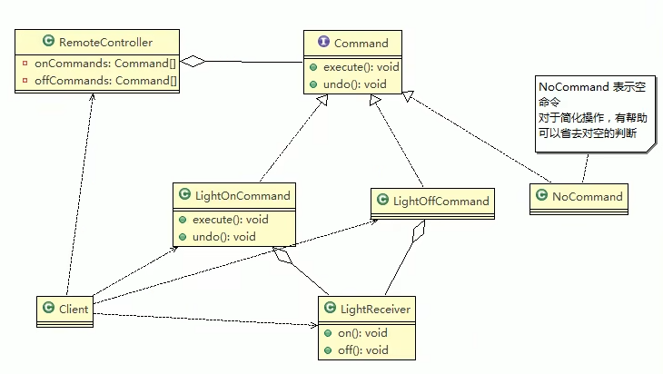

### 智能生活项目需求：
>1. 我们买了一套智能家电，有照明灯、风扇、冰箱、洗衣机，我们只要在手机上安装app就可以控制对这些家电工作。
>2. 这些智能家电来自不同的厂家，我们不想针对每一种家电都安装一个App，分别控制，我们希望只要一个app就可以控制全部智能家电。
>3. 要实现一个app控制所有智能家电的需要，则每个智能家电厂家都要提供一个统一的接口给app调用，这时就可以考虑使用命令模式。
>4. 命令模式可将“动作的请求者”从“动作的执行者”对象中解耦出来.
>5. 在我们的例子中，动作的请求者是手机app，动作的执行者是每个厂商的一个家电产品
### 命令模式解决智能生活项目
>1. 思路分析和图解
>  
