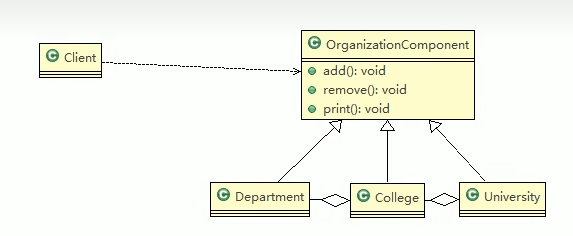

# 学校院系展示需求：
> 编写程序展示一个学校院系结构：需求是：要在一个页面中展示出学校的院系组成，一个学校有多少个学院，一个学院有多少个系。
> 如：------清华大学------
>    ---计算机科学与技术---
>    计算机科学与技术
>    软件工程
>    网络工程
>    -----信息工程学院-----
>    通信工程
>    信息工程

### 解决方案1（传统）
>1. 将学院看做学校的子类，系是学院的子类，这样实际上是站在组织大小来进行分层次的。
>2. 实际上我们要求的是：在一个页面中展示出学校的院系组成，一个学院有多少个学院、系，因此这种方案不能很好地实现管理的操作，比如学院、系的增加、删除、遍历等。
>3. 解决方案：把学校、院、系都看做是组织结构，他们之间没有继承关系，而是一个树形结构，可以更好地实现管理操作 => 组合模式

### 解决方案2 （组合模式）
 