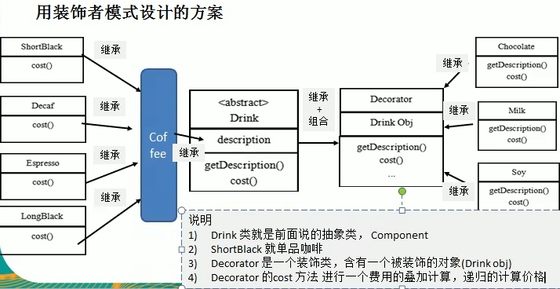

# 装饰者模式定义
>1. 装饰者模式:**动态的将新功能附加到对象上**。在对象功能扩展方面，它比继承更有弹性,装饰者模式也体现了开闭原则(ocp)
>2. 这里提到的动态的将新功能附加到对象和ocp原则，在后面的应用实例上会以代码的形式体现,请同学们注意体会。

### 装饰者模式原理
##### 1. 装饰者模式就像打包一个快递
>- 主体:比如:陶瓷、衣服(Component) // 被装饰者  
>- 包装:比如:报纸填充、塑料泡沫、纸板、木板(Decorator)
##### 2. Component
>- 主体:比如类似前面的Drink
##### 3. ConcreteComponent 和 Decorator
>- ConcreteComponent:具体的主体，比如前面的各个单品咖啡  
>- Decorator:装饰者，比如各调料. 

