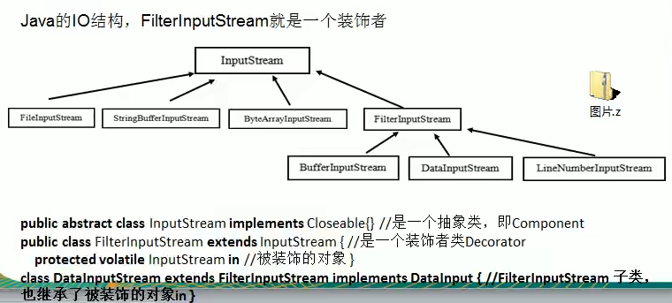

# 装饰者模式在JDK源码中的应用

>1. InputStream是抽象类,类似我们前面讲的Drink
>2. FileInputStream 是 InputStream子类,类似我们前面的DeCaf，LongBlack
>3. FilterInputStream是InputStream子类:类似我们前面的Decorator修饰者
>4. DataInputStream是FilterInputStream子类，具体的修饰者，类似前面的Milk,Soy等
>5. FilterInputStream类有 protected volatile InputStream in;即含被装饰
>6. 分析得出在jdk的io体系中,就是使用装饰模式