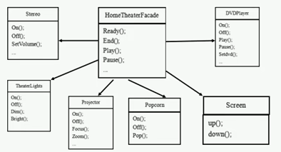

# 影院管理项目：
> 组建一个家庭影院：
>> DVD播放器、投影仪、自动屏幕、环绕立体声、爆米花机，要求完成使用家庭影院的功能，其过程为：
>>- 直接用遥控器：统筹各设备开关
>>- 开爆米花机
>>- 放下屏幕
>>- 开投影仪
>>- 开音响
>>- 开DVD,选DVD
>>- 去拿爆米花
>>- 调暗灯光
>>- 播放
>>- 观影结束后，关闭各种设备

### 传统方式解决影院管理
> 创建出各个对象，然后每个对象中声明各自的一系列功能方法 统一由Client调用
### 传统方式解决影院管理问题分析
>1. 在ClientTest的main方法中，创建各个子系统的对象，并直接去调用子系统（对象）相关方法，会造成调用过程混乱，没有清晰的过程。
>2. 不利于在ClientTest中，去维护对子系统的操作。
>3. 解决思路：定义一个个高层接口，给子系统中的一组接口提供一个**一致的界面（比如在高层接口提供四个方法ready，play，pause，end）**，用来访问子系统中的一群接口。
>4. 也就是说，通过定义一个一致的接口（界面类），用以屏蔽内部子系统的细节，使得调用端只需跟这个接口发生调用，而无需关心这个子系统的内部细节 => 外观模式。

### 外观模式解决影院管理
>1. 外观模式可以理解为转换一群接口，客户只要调用一个接口，而不用调用多个接口才能达到目的。比如：在pc上安装软件的时候经常有一键安装选项（省去选择安装目录、安装的组件等等），还有就是手机的重启功能（把手机关机和启动合为一个操作）
>2. 外观模式就是解决对个复杂接口带来的使用困难，起到简化用户操作的作用。
>3. 外观模式解决影院管理问题示意图  
