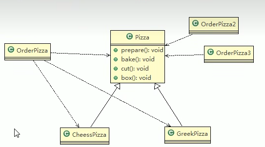
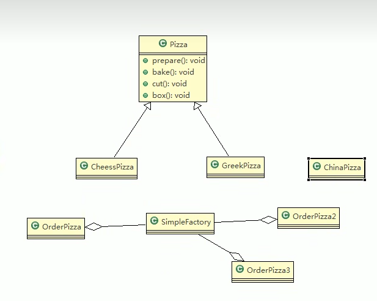

# 简单工厂模式
1. 简单工厂模式是属于创建型模式，是工厂模式的一种。**简单工厂模式是由一个对象决定创建出哪一种产品类的实例。** 简单工厂模式是工厂模式家族中最简单使用的模式
2. 简单工厂模式：定义了一个创建对象的类，由这个类来**封装实例化对象的行为（代码）**
3. 在软件开发中，当我们会用到大量的创建某种、某类或者某批对象时，就会使用到工厂模式。
                                                     
# 分析思路
##### 把创建Pizza对象封装到一个类中，这样我们有新的Pizza种类时，只需要修改类就可，其他有创建对象的代码就不需要修改了 -> 简单工厂模式

* 该UML类图可以看出，新增Pizza种类时，所有的OrderPizza类都要修改，修改的内容过多

* 此类图可以看出，新增披萨时，只需要修改生成披萨的工厂，而聚合工厂的OrderPizza不需要修改，方便了很多