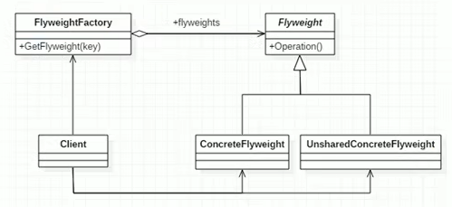

# 享元模式
### 1. 基本介绍
> 1. 享元模式（Flyweight Pattern）也叫蝇量模式：运用共享技术有效地支持大量细粒度的对象。
> 2. 常用于系统底层开发，解决系统的性能问题。像**数据库连接池**，里面都是创建好的连接对象，在这些连接对象中有我们需要的则直接拿来用，避免重新创建，如果没有我们需要的，则创建一个。
> 3. 享元模式能够解决**重复对象的内存浪费问题**，当系统中有大量相似的对象，需要缓冲池时。不需要总是创建新对象，可以从缓冲池里拿。这样可以降低系统内存，同时提高效率。
> 4. **享元模式经典的应用场景就是池技术**。String常量池、数据库连接池和缓冲池等等都是享元模式的应用，享元模式是池技术的重要实现方式。  
### 2. 享元模式的原理类图 
>   
> #### 1. 享元模式的原理类图说明（模式的角色及职责）
> 1. Flyweight：抽象的享元角色，它是产品的抽象类，同时定义出对象的外部状态和内部状态
> 2. ConcreteFlyweight：具体的享元角色，是具体的产品类，实现抽象角色定义的相关业务
> 3. UnShareConcreteFlyweight：不可共享的角色，一般不会出现在享元工厂
> 4. FlyweightFactory：享元工厂，用于构建一个池容器（集合），同时提供从池中获取对象的方法
> ##### 2. 介绍一下外部状态和内部状态
> 比如围棋、五子棋、跳棋，它们都有大量的棋子对象，围棋和五子棋只有黑白两色，跳棋颜色多一点，所有棋子颜色就是棋子的内部状态；而各个棋子之间的差别就是位置不同，当我们落子后，落子颜色是定的，但位置是变化的，所以棋子坐标就是棋子的外部变化
> 1. 享元模式提出了两个要求：细粒度和共享对象。这里就是设计到内部状态和外部状态了，即将对象的信息分为两个部分：外部状态和内部状态
> 2. 内部状态是指对象共享出来的信息，存储在享元对象内部且不会随环境的改变而改变
> 3. 外部状态是指对象得以依赖的一个标记，是随环境改变而改变的、不可共享的状态
> 4. 举个例子:围棋理论上有361个空位可以放棋子，每盘棋都有可能有两三百个棋子对象产生，因为内存空间有限，一台服务器很难支持更多的玩家玩围棋游戏，如果用享元模式来处理棋子，那么棋子对象就可以减少到只有两个实例，这样就很好的解决了对象的开销问题
### 3. 享元模式的注意事项和细节
> 1. 享元模式 -> ”享” 就是共享，“元” 就是对象
> 2. 系统中有大量的对象，这些对象消耗大量内存，并且对象的状态大部分可以外部化时，我们就可以考虑使用享元模式
> 3. 用唯一标识码判断，如果在内存中有，则返回这个唯一标识码所标识的对象，用HashMap/HashTable存储
> 4. 享元模式大大减少了对象的创建，降低了程序内存的占用，提高效率
> 5. 享元模式提高了系统的复杂度。需要分离出内部状态和外部状态，而外部状态具有固化特性，不应该随内部状态的改变为改变，这是我们**使用享元模式需要注意的地方**
> 6. 使用享元模式时，之一划分内部状态和外部状态，并且需要有一个工厂类加以控制。
> 7. 享元模式经典的应用场景就是需要缓冲池的场景，比如String常量池、数据库连接池
