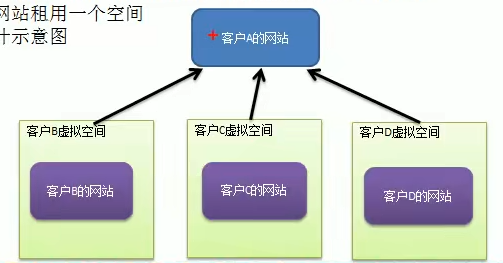
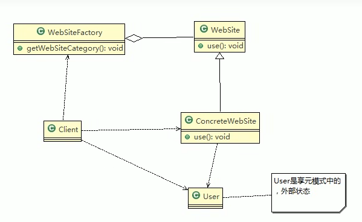

# 需求：
>#### 小型的外包项目，给客户A做一个产品展示网站，客户A的朋友感觉效果不错，也希望做这样的产品展示网站，但是要求有些不同：
> 1. 有客户要求以新闻的形式发布。
> 2. 有客户要求以博客的形式发布。
> 3. 有客户希望以微信公众号的形式发布。
  
# 解决方案
>#### 传统方案
> 1. 直接赋值粘贴一份，然后根据客户不同要求，进行定制修改
> 2. 给每一份网站租用一个空间
> 3. 方案设计图  

>##### 传统方案分析
> 1. 需要的网站结构相似度很高，而且都不是高访问量网站，如果分成多个虚拟空间来处理，相当于一个相同网站的实例对象很多，造成服务器的资源浪费
> 2. 解决思路：整合到一个网站中，共享其相关代码和数据，对于硬盘、内存、CPU，数据库空间等服务器资源都可以达成共享，减少服务器资源
> 3. 对于代码来说，由于是一份实例，维护和扩展都更加容易
> 4. 上面的解决思路就是可以使用享元模式来解决 
> ##### 享元模式方案
> 1. 享元模式方案类图
> 