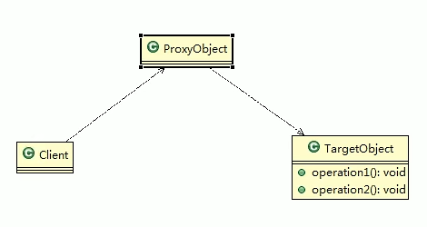
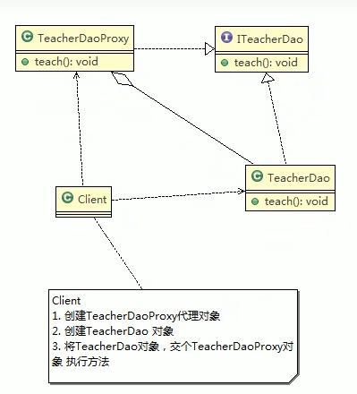
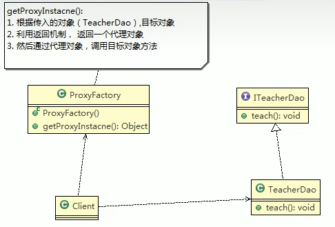
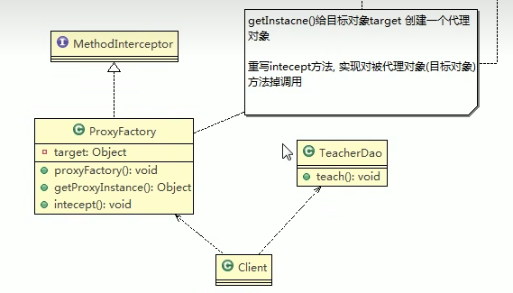
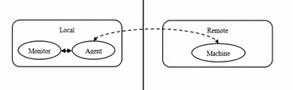

# 代理模式
### 1. 基本介绍
> 1. 代理模式：为一个对象提供一个替身，一控制对这个对象的访问。即通过代理对象访问目标对象，这样做的好处是：可以在目标对象实现的基础上，增强额外的功能操作，即扩展目标对象的功能
> 2. 被代理的对象可以是远程对象、创建开销大的对象或需要安全控制的对象
> 3. 代理模式有不同的形式，只要有三种分别是：静态代理、动态代理（JDK代理、接口代理）和Cglib代理（可以在内存动态的创建对象，而不需要实现接口，属于动态代理的范畴）
### 2. 代理模式原理图

### 3. 静态代理
> 静态代理在使用时，需要定义接口或者父类，被代理对象（即目标对象）与代理对象一起实现相同的接口或者是继承相同父类
> #### 3.1 静态代理 - 应用实例
> 具体要求
> 1. 定义一个接口:ITeacherDao
> 2. 目标对象TeacherDao实现接口ITeacherDao
> 3. 使用静态代理方式，就需要在代理对象TeacherDaoProxy中也实现ITeacherDao
> 4. 调用的时候通过调用代理对象的方法来调用目标对象
> 5. 特别提醒：代理对象与目标对象要实现相同的接口，然后通过调用相同的方法来调用目标对象的方法
> 6. 本案例UML类图 <br>
>   
> #### 3.2. 静态代理的优缺点分析
> - 优点：在不修改目标对象的功能前提下，能通过代理对象对目标功能扩展
> - 缺点：因为代理对象要与目标对象实现一样的接口，所以会有很多代理类
> - 一旦接口增加方法，目标对象与代理对象都需要维护
### 4. 动态代理
> #### 4.1 动态代理基本介绍
> - 代理对象不需要实现接口，但是目标对象要实现接口，否则不能用动态代理
> - 代理对象的生成，是利用JDK的API，动态的在内存中构建代理对象
> - 动态代理也叫JDK代理、接口代理
> #### 4.2 JDK中生成代理对象的API
> 1. 代理类所在包：java.lang.reflect.proxy
> 2. JDK实现代理只需要使用newProxyInstance方法，但是该方法需要接收三个参数
> ```java
> static Object newProxyInstance(ClassLoader loader, Class<?>[] interfaces, InvocationHandler h) {}
> ```
> #### 4.3 动态代理 - 应用实例
> 具体要求
> 1. 定义一个接口:ITeacherDao
> 2. 目标对象TeacherDao实现接口ITeacherDao
> 3. 使用静态代理方式，就需要在代理对象TeacherDaoProxy中也实现ITeacherDao
> 4. 调用的时候通过调用代理对象的方法来调用目标对象
> 5. 特别提醒：代理对象与目标对象要实现相同的接口，然后通过调用相同的方法来调用目标对象的方法
> 6. 本案例UML类图 <br>
> 
### 5. Cglib代理
> #### 5.1 Cglib代理基本介绍
> 1. 静态代理和JDK代理模式都要求目标对象（被代理对象）实现一个接口，但是有时候目标对象只有是一个单独的对象，并没有实现任何的接口，这个时候可使用目标对象子类来实现代理-这就是Cglib代理
> 2. Cglib代理也叫子类代理，它是在内存中构建一个子类对象从而实现对目标对象功能扩展，有些书也将Cglib代理归属到动态代理
> 3. Cglib是一个强大的高性能的代码生成包，它可以在运行期扩展java类与java接口。它广泛的被许多AOP的框架使用，例如Spring AOP，实现方法拦截
> 4. 在AOP编程中如何选择代理模式：
>    1. 目标对象需要实现接口，用JDK代理
>    2. 目标对象不需要实现接口，用Cglib代理
> 5. Cglib包的底层是通过使用字节码处理框架ASM来转换字节码并生成新的类
> #### 5.2 Cglib代理模式实现步骤
> 1. 需要引入cglib的jar文件
> 2. 在内存中动态构建子类，注意代理的类不能为final，否则报错 java.lang.illegalArgumentException;
> 3. 目标对象的方法如果为final/static，那么就不会被拦截，即不会执行目标对象额外的业务方法
> #### 5.3 Cglib代理 - 应用实例
> UML类图 <br>
> 
### 6. 代理模式的几种变体
> #### 6.1. 几种常见的代理模式介绍
> 1. 防火墙代理
>   > 内网通过代理穿透防火墙，实现对公网的访问 
> 2. 缓存代理
>   > 比如：当请求图片文件等资源时，先到缓存代理取，如果取到资源则ok，如果取不到资源，再到公网或数据库取，然后缓存
> 3. 远程代理
>   > 远程对象的本地代表，通过它可以把远程对象当本地对象来调用。远程代理通过网络和真正的远程对象沟通信息。 <br>
    > 
> 4. 同步代理
>   > 主要使用在多线程编程中，完成多线程同步工作 