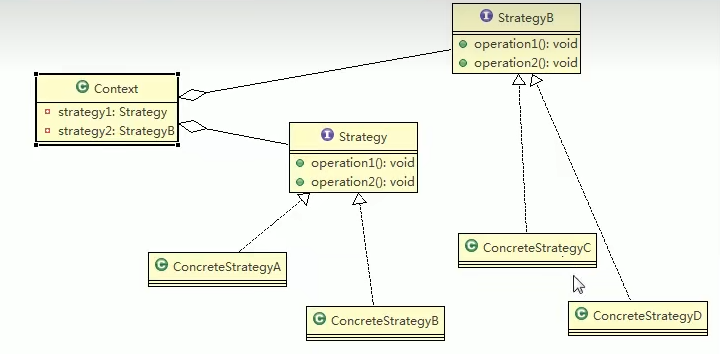
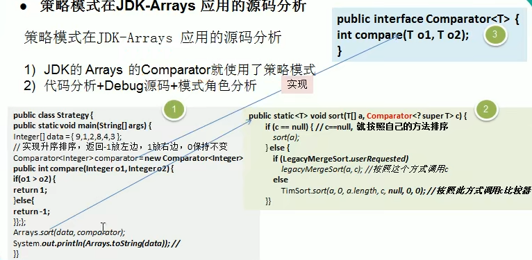

# 策略模式
### 1. 策略模式基本介绍
> 1. 策略模式（Strategy Pattern）中，定义算法族(策略组)，分别封装起来，让他们之间可以互相替换，此模式让算法的变化独立于使用算法的客户
> 2. 这个算法体现了几个设计原则
>   >1. 把变化的代码从不变的代码中分离出来
>   >2. 针对接口编程而不是具体类（定义了策略接口）
>   >3. 多用组合/聚合，少用继承（客户通过组合方式使用策略）
### 2. 策略模式的原理
> #### 2.1 策略模式的原理类图
> 
> #### 2.2 策略模式原理类图说明
> 客户Context有成员变量Strategy或者其他的策略接口，至于需要使用到哪个策略，我们可以在构造器中指定
### 3. 策略模式在JDK中的应用
> 
### 4. 策略模式的注意事项和细节 
> 1. 策略模式的关键是：分析项目中变化部分与不变部分
> 2. 策略模式的核心思想是：多用组合/聚合，少用继承，用行为类组合，而不是行为的继承。更有弹性
> 3. 体现了“对修改关闭，对扩展开发”原则，客户端增加行为不用修改原有代码，只要添加一种策略（或者行为）即可，避免了使用多重if、else
> 4. 提供了可以替换继承关系的办法：策略模式将算法封装在独立的Strategy类中使得你可以独立于其Context改变它，使它易于切换、理解和扩展
> 5. 需要注意的是：每添加一个策略就要增加一个类，当策略过多时是会导致类数目庞大