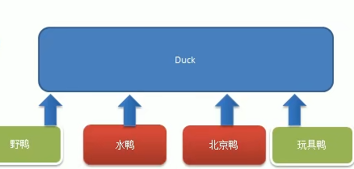
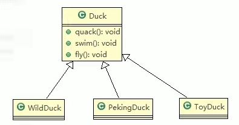
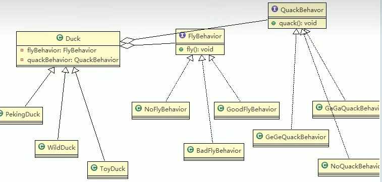

# 鸭子问题
### 1. 编写鸭子项目，，具体要求如下：
> 1. 由各种各样的鸭子（比如：野鸭、北京鸭、水鸭和玩具鸭等，鸭子有各种行为，如叫、飞等）
> 2. 显示鸭子的信息
### 2. 传统方案解决鸭子问题
> 1. 传统方案解决鸭子问题的示例图  
>   
> 2. 传统方案解决鸭子问题的UML类图  
> 
> #### 2.1 传统方式解决鸭子问题的分析
> 1. 所有鸭子都继承了Duck类，所以所有鸭子都会飞，这是不正确的
> 2. 第一条所说的问题其实是继承所带来的问题：对类的局部改动，尤其超类的局部改动，会影响其他部分。会有溢出效应
> 3. 为例改进第一条所说的问题，我们可以通过覆盖fly方法来解决 -> 覆盖解决
> 4. 问题由来了，如果我们有个玩具鸭，这样就需要覆写Duck的所有方法,因此可以使用提出另一思路 => 策略模式
### 3. 策略模式解决鸭子问题  
> 1. 策略模式解决鸭子问题的示例图  
>   