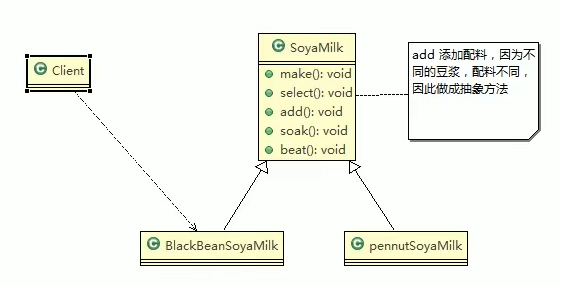

### 豆浆制作问题
> 编写豆浆制作程序，说明如下：
> 1. 制作豆浆的流程 选材 -> 添加配料 -> 浸泡 -> 放入豆浆机打碎
> 2. 通过添加不同的配料，可以制作出不同口味的豆浆
> 3. 选材、浸泡和放到豆浆机打碎这几个步骤对于制作每种口味的豆浆都是一样的
> 4. 请使用模版方法模式完成（说明：因为模版方法模式，比较简单，很容易就想到这个方案，因此就直接使用，不再使用传统的方案来引出模版方法模式）
### 模版方法解决豆浆制作问题
> 1. UML类图   
>   