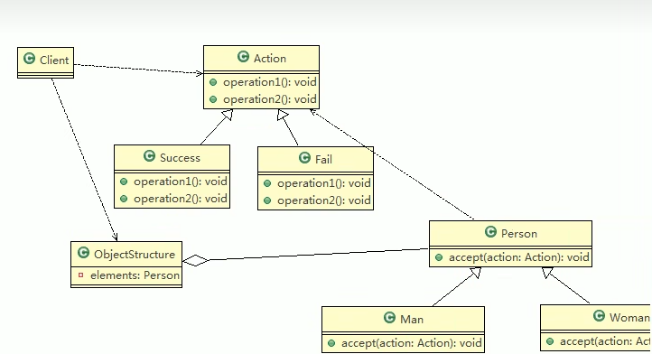

### 1. 测评系统需求：
> 将观众分成男人和女人，对歌手进行评测，当看完某个歌手表演后，得到他们对该歌手不同的评价（评价有不同的种类，比如：成功、失败等）
### 2. 传统方案解决测评系统
> 定义一个person类，然后man和woman类去继承，在根据歌手的表现做出响应的评价
> ##### 2.1 传统方式的问题分析
> 1. 如果系统比较小，这样写是ok的，但是考虑系统增加越来越多的功能是，对代码改动较大， 违反了ocp原则
> 2. 扩展性不好，比如：增加了新的人员类型，或者管理方法，都不好做
### 3 访问者模式解决测评系统 
> ##### 3.1 访问者模式解决测评系统的类图
> 