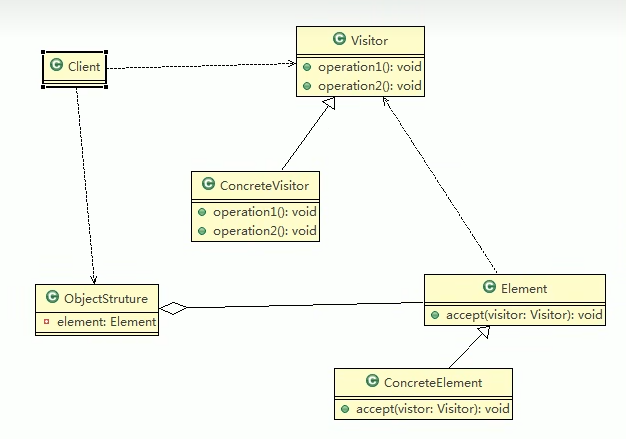

# 访问者模式
### 1. 访问者模式基本介绍
> 1. 访问者模式（Visitor Pattern）：封装一些作用于某种数据结构的各元素的操作，它可以在不改变数据结构的前提下定义作用于这些元素的新的操作
> 2. 主要将数据结构于数据操作分离，解决数据结构和操作耦合性的问题
> 3. 访问者模式的基本工作原理是：在被访问的类里面加一个对外提供待访问者的接口
> 4. 访问者模式的主要应用场景式：需要对一个对象结构中的对象进行很多不同的操作（这些操作彼此没有关联），同时需要避免让这些操作“污染”这些对象的类
### 2. 访问者模式原理
> ##### 2.1 访问者模式原理类图 
> 
> ##### 2.2 访问者模式原理类图说明
> - Visitor：抽象访问者，为该对象结构中的ConcreteElement的灭一个类声明一个visit操作
> - ConcreteVisitor：是一个具体的访问者，实现每个有Visitor声明的操作，是每个操作的实现部分
> - Element：定义一个accept方法，接收一个访问者对象
> - ConcreteElement：具体元素，实现了accept方法
> - ObjectStructure：能枚举它的元素，可以提供一个高层的接口，用来允许访问者访问元素
### 3. 访问者模式的注意事项和细节
> 1. 优点：
>   1. 访问者模式符合单一职责原则，让程序具有优秀的扩展性，灵活性非常高
>   2. 访问者模式可以对功能进行统一，可以做报表、UI、拦截器与过滤器，适合用于数据结构相对稳定的系统
> 2. 缺点：
>   1. 具体元素对访问者公布细节，也就是说访问者关注了其他类的内部细节，这是迪米特法则所不建议的，这样造成了具体元素变更比较困难
>   2. 违背了依赖倒置原则，访问者依赖的是具体元素，而不是抽象元素
>   3. 因此，如果一个系统有比较稳定的数据结构，又经常变化的功能需求，那么访问者模式就是比较适合的